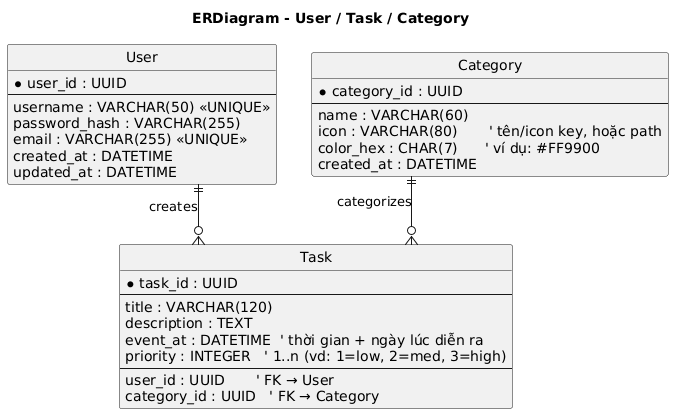
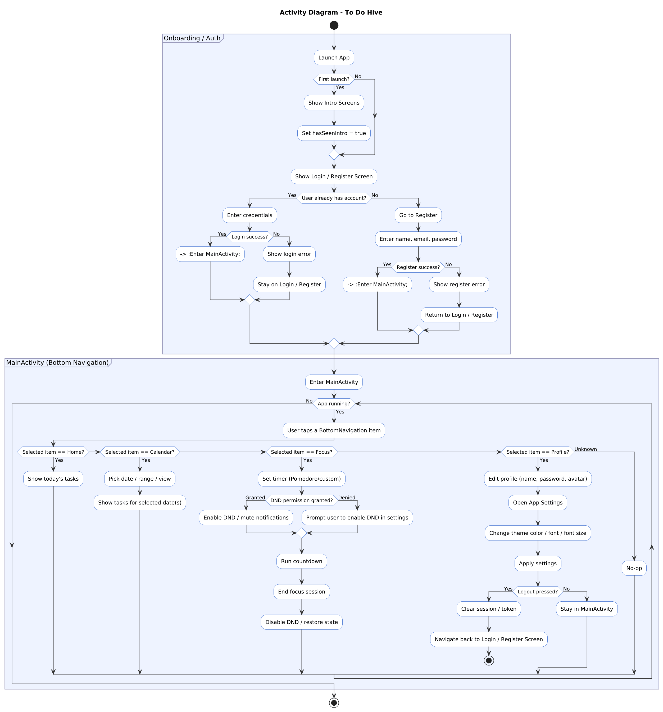

# ToDoHive App

An Android application that helps users manage their tasks — create reminders, organize schedules, edit profiles, and customize the interface.

---

## Activity Flow

1. **Intro Screen**

   * Displayed only the first time the user opens the app.
   * After completion → navigates to the Login/Register screen.

2. **Authentication**

   * **Login:** If successful → proceed to `MainActivity`.
   * **Register:** If the user has no account, they must register first → upon success → proceed to `MainActivity`.

3. **MainActivity with Bottom Navigation**
   Includes four main fragments:

   * **Home Fragment:** Displays today’s tasks.
   * **Calendar Fragment:** Shows tasks by day/week/month as selected by the user.
   * **Bin Fragment:** Acts as a trash bin containing deleted tasks; users can restore or permanently delete them here.
   * **Profile Fragment:**

     * Edit name, password, and profile image.
     * **Logout:** Returns to the Login/Register screen.

---

## Technologies Used

* **Kotlin** + **XML Layout**
* **MVVM Architecture** (ViewModel + LiveData + Repository + Room)
* **Room Database** (CRUD operations for tasks)
* **Material Design Components**
* **Cloudinary** for image upload and URL storage in Room Database
* **Navigation Component** + **BottomAppBar**

---

## Required Supporting Documents

* **Figma Design File:** [Figma](https://www.figma.com/design/LRVrvGHMESFCsBnefyLQmP/UpTodo---Todo-list-app-UI-Kit--Community-?node-id=0-1&p=f&t=FNBNRS5aGF9ye1jw-0)
* **UML Diagrams:**

  * **Entity Relationship Diagram (ERD):**
    
  * **Activity Diagram:**
    
* **Project Management Link:** [Linear Board](https://linear.app/todohive/team/TOD/active)

---

## Key Features

* **CRUD Tasks:** Add, edit, delete, and view tasks.
* **Calendar View:** Filter and browse tasks by date.
* **Notifications:** Remind users of upcoming or missed tasks.
* **Restore & Delete:** Manage deleted tasks in the Bin.
* **Profile Management:** Edit user info and log out.

---

## License

**MIT License** – free to use and develop.