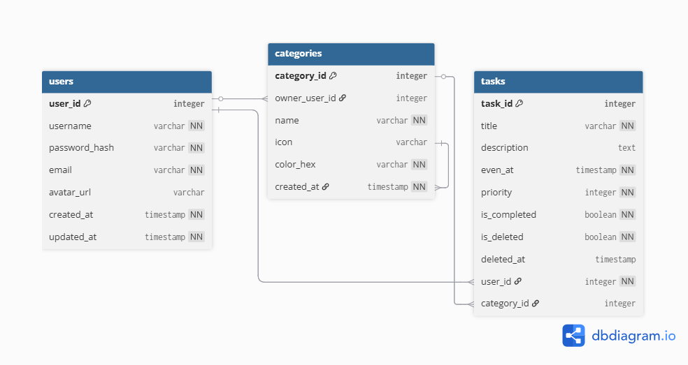

# ToDoHive App

An Android application that helps users manage their tasks — create reminders, organize schedules, edit profiles, and customize the interface.
* **Link Demo Youtube:** [ToDoHive](https://www.youtube.com/watch?v=3WlN7omSyz4&feature=youtu.be)
---
- [ToDoHive App](#todohive-app)
  - [Activity Flow](#activity-flow)
  - [Project Structure](#project-structure)
  - [Technologies Used](#technologies-used)
    - [Android Jetpack Components](#android-jetpack-components)
    - [UI/UX and Design](#uiux-and-design)
    - [External Services \& Libraries](#external-services--libraries)
    - [System \& Utilities](#system--utilities)
  - [Required Supporting Documents](#required-supporting-documents)
  - [Key Features](#key-features)
  - [License](#license)
---

## Activity Flow

1. **Intro Screen**

   * Displayed only the first time the user opens the app.
   * After completion → navigates to the Login/Register screen.

2. **Authentication**

   * **Login:** If successful → proceed to `MainActivity`.
   * **Register:** If the user has no account, they must register first → upon success → proceed to `MainActivity`.

3. **MainActivity with BottomAppBar**
   Includes four main fragments:

   * **Home Fragment:** Displays today’s tasks.
   * **Calendar Fragment:** Shows tasks by day/week/month as selected by the user.
   * **Bin Fragment:** Acts as a trash bin containing deleted tasks; users can restore or permanently delete them here.
   * **Profile Fragment:**

     * Edit name, password, and profile image.
     * **Logout:** Returns to the Login/Register screen.
---
## Project Structure
```bash
todohive
├── App.kt
├── common
│   ├── LiveDataExtensions.kt
│   ├── SpacesItemDecoration.kt
│   ├── SwipeToDeleteCallback.kt
│   ├── SwipeToRestoreDeleteCallback.kt
│   └── TimeFormatUtils.kt
├── data
│   └── local
│       ├── AppDatabase.kt
│       ├── dao
│       │   ├── CategoryDao.kt
│       │   ├── TaskDao.kt
│       │   └── UserDao.kt
│       ├── entity
│       │   ├── CategoryEntity.kt
│       │   ├── TaskEntity.kt
│       │   └── UserEntity.kt
│       ├── InstantConverters.kt
│       └── model
│           ├── CategoryOption.kt
│           ├── OnboardingPage.kt
│           ├── Priority.kt
│           ├── Task.kt
│           └── TaskWithCategory.kt
├── domain
├── notification
│   ├── NotificationScheduler.kt
│   ├── NotificationService.kt
│   └── TaskReminderReceiver.kt
├── repository
│   └── TaskRepository.kt
└── ui
    ├── adapter
    ├── auth
    │   ├── LogInFragment.kt
    │   └── RegisterFragment.kt
    ├── home
    │   ├── bin
    │   │   ├── BinFragment.kt
    │   │   ├── TaskBinAdapter.kt
    │   │   └── TaskBinViewModel.kt
    │   ├── binding
    │   │   ├── CategoryBindingAdapter.kt
    │   │   └── DoneBindingAdapter.kt
    │   ├── calendar
    │   │   ├── CalendarFragment.kt
    │   │   ├── CalendarViewModel.kt
    │   │   └── WeekDayAdapter.kt
    │   ├── category
    │   ├── CreateCategoriesActivity.kt
    │   ├── profile
    │   │   ├── changeimage
    │   │   │   └── BottomsheetChangeImage.kt
    │   │   ├── changename
    │   │   │   ├── BottomsheetChangeName.kt
    │   │   │   └── ChangeNameSheetViewModel.kt
    │   │   ├── changepassword
    │   │   │   ├── BottomsheetChangePassword.kt
    │   │   │   └── ChangePasswordSheetViewModel.kt
    │   │   ├── ProfileFragment.kt
    │   │   └── ProfileViewModel.kt
    │   ├── task
    │   │   ├── add
    │   │   │   ├── AddTaskSheet.kt
    │   │   │   └── AddTaskSheetViewModel.kt
    │   │   ├── CategoryAdapter.kt
    │   │   ├── CategoryOptionAdapter.kt
    │   │   ├── CategoryViewModel.kt
    │   │   ├── edit
    │   │   │   ├── EditTaskSheet.kt
    │   │   │   └── EditTaskSheetViewModel.kt
    │   │   ├── IndexFragment.kt
    │   │   ├── PickCategorySheet.kt
    │   │   ├── PickPrioritySheet.kt
    │   │   ├── PickTimeSheet.kt
    │   │   ├── PriorityAdapter.kt
    │   │   ├── TaskAdapter.kt
    │   │   ├── TaskDetailViewModel.kt
    │   │   ├── TasksViewModel.kt
    │   │   └── TimeFmt.kt
    │   └── TaskFragment.kt
    ├── HomeActivity.kt
    ├── icons
    │   └── CategoryIconRegistry.kt
    ├── MainActivity.kt
    └── onboarding
        ├── OnboardingAdapter.kt
        ├── OnboardingFragment.kt
        └── StartScreenFragment.kt
```
---

## Technologies Used

* **Platform & Language:** **Kotlin** on **Android** (targeting API 36, minimum API 32).
* **Architecture:** **MVVM** (Model-View-ViewModel) using **Android Jetpack** components.
* **Asynchronous Operations:** **Kotlin Coroutines** (used in ViewModels and Repository layer).


### Android Jetpack Components

* **Persistence:** **Room Database (v2.7.2)** for local data persistence (Tasks, Categories, Users).
* **Data & Lifecycle:** **ViewModel** and **LiveData** (including custom extensions like `combineWith`) for observable, lifecycle-aware data handling.
* **Navigation:** **Navigation Component** and **Safe Args** for secure and managed Fragment navigation across `MainActivity` and `HomeActivity`.
* **Startup:** **AndroidX Core Splash Screen** (`core-splashscreen:1.0.0`).

### UI/UX and Design

* **Design System:** **Material Design Components (`com.google.android.material:material`)** for modern UI elements like:
    * **Bottom Navigation View.**
    * **Snackbars.**
    * **Material DatePicker** and **Material TimePicker.**
* **Data Presentation:** **RecyclerView** with **ListAdapter** and **DiffUtil** for efficient list rendering.
* **Advanced Interaction:** **ItemTouchHelper** and custom callbacks (`SwipeToDeleteCallback`, `SwipeToRestoreDeleteCallback`) to implement swipe gestures (delete/restore) on task lists.
* **View Layer:** **Data Binding** and **View Binding** are enabled for robust UI programming.


### External Services & Libraries

* **Image Handling (Remote):** **Cloudinary SDK** (`cloudinary-android:3.0.2`) for user profile picture uploading and media management.
* **Image Handling (Local):** **Glide** (`com.github.bumptech.glide:glide:4.16.0`) for efficient image loading, displaying, and transformations (e.g., `circleCrop()`).

### System & Utilities

* **Scheduling & Notifications:** Native Android APIs (**AlarmManager** and **BroadcastReceiver**) are used to schedule and trigger timed reminders for tasks.
* **Modern Java Features:** **Core Library Desugaring** is used to enable modern Java APIs, specifically the **`java.time`** package (Instant, LocalDate, LocalTime) for robust date and time management.
---

## Required Supporting Documents
* **Figma Design File:** [Figma](https://www.figma.com/design/LRVrvGHMESFCsBnefyLQmP/UpTodo---Todo-list-app-UI-Kit--Community-?node-id=0-1&p=f&t=FNBNRS5aGF9ye1jw-0)
* **UML Diagrams:**

  * **Entity Relationship Diagram (ERD):**
    
  * **Activity Diagram:**
    
* **Project Management Link:** [Linear Board](https://linear.app/todohive/team/TOD/active)

---

## Key Features

* **CRUD Tasks:** Add, edit, delete, and view tasks.
* **Calendar View:** Filter and browse tasks by date.
* **Notifications:** Remind users of upcoming or missed tasks.
* **Restore & Delete:** Manage deleted tasks in the Bin.
* **Profile Management:** Edit user info and log out.

---

## License

**MIT License** – free to use and develop.